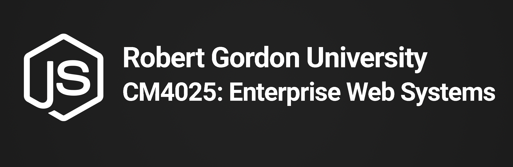

## CM4025 - Enterprise Web Systems



The CM4025 Enterprise Web Systems Project is a full stack application designed to monitor the activity of the users 
written in JavaScript ES6.
It supports Databases such as MongoDB.

## CM4025 Enterprise Web Systems Project Compile-time Dependencies

* [nodejs](https://nodejs.org/en) (required)
* [Git](https://git-scm.com) (optional)

## Installation

The [CM4025 Enterprise Web Systems Project installation guides] includes instructions for installing 
the project as part of a local application.

## CM4025 Enterprise Web Systems Unit

### Run-time options:

#### Installing Packages

##### In Root Directory

##### Open Command Line or PowerShell and Execute

```bash
npm install
```

##### In Client Directory

##### Open Command Line or PowerShell and Execute

```bash
npm install
```

##### In Server Directory

##### Open Command Line or PowerShell and Execute

```bash
npm install
```

#### Run Instructions

##### In Root Directory

##### Open Command Line or PowerShell and Execute

```bash
npm run dev
```

##### OR

##### In Separate Command Line or PowerShell Instances

```
cd server
npm run start

cd client
npm run start
```

#### Build Instructions

```
cd client
npm run build